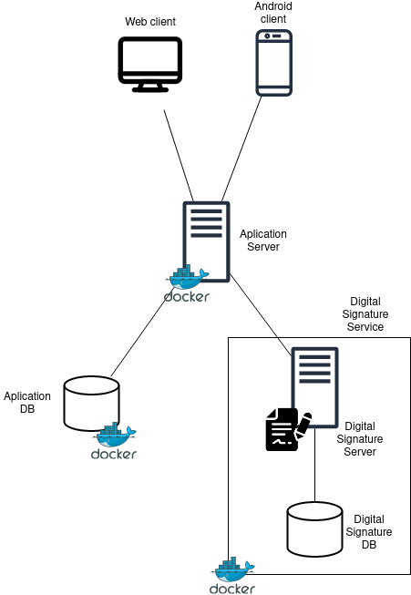

# Table of Contents

1.  [Planification](#org039a74e) 
    1. [User Stories](#org039a74e1)
    2. [Sprint 1](#org039a74e2)
2.  [Requirements - Product](#org30e4382) 
3.  [Main use cases](#orgc47d17e) 
4.  [General architecture](#org0c10ad2) 
5.  [Database model](#org03a016d) 
    1.  [Users model](#org71bfb5a)
    2.  [Enterprise Module](#org7015789)
    3.  [Product Module](#org2e942e4)
    4.  [Formal Offer module](#orgd5e0a34)
6.  [Web application](#orgc6dbfff) 
    1.  [Authentication](#org712facd)
7.  [Financial Factors](#orga29bc04) 

# Planification

## User Stories

The first thing that was done regarding the planification of the project was to define the behavior of the application in a list of user stories. The next list exposes all of the actions that the user can do with it  as well as different ways of interacting with it.

- **US1:** As a guest, I want to register in the application 
- **US2:** As a user, I want to log in to the application. 
- **US3:** As a registered user, I want to create a profile of my company.
- **US4:** As a guest, I want to search for services or products so that I receive said list.
- **US5:** As a guest, I want to have a detailed view of the product/service.
- **US6:** As a registered user who has a company profile, I want to create services/products.
- **US7:** As a user, I want to be able to *connect* with a company that has made a publication.
- **US8:** As a user, I need to be able to speak in a chat with the company that I connected.
- **US9:** As a company, I want to respond in the chat with the users that have sent messages.
- **US10:** As a company, I want to send a Formal Offer which contains a  contract as a PDF through the chat.
- **US11:** As a company, I want to digitally sign contracts.
- **US12:** As a user, I want to digitally sign contracts.
- **US13:** As a user, I want to recive evidences of the proces when a contract is signed. 
- **US14:** As a user, I want to recive billing and invoices regarding the signed comertial transaction contract.

## Sprint 1

The next step was creating a Scrum Board inside a Github project with the following structure:

Afterwards, a meeting was hold in order to fullfill the product backlog with all the tasks that had to be done. This tasks were related to User Stories, but they were divided so that the product backlog had a small granularity in the given tasks.

Later, all the tasks were described as a list of things to implement. Additionaly, a weight was given for the complexity of the task, and said weight has to be a number on the Fibbonacci Sequence.

<<< ??
Once all the tasks were created, a period for reviewing each one of them started. In this period, all the descriving what has to be done and giving a weight based on the complexity of the task. This weight is given following the Fibbonacci Sequence.
<<< @quimpm @sergisi

After that, all the tasks that had to be done in the First Sprint were moved in a *To Do* column in the project, which was the name that was given to the commonly said **Sprint Backlog**.

Finally, the assignation of the tasks were given as a self assignation, as all of the team wanted to contribute. By having each one choose their own work, it makes it easier to stay motivated.

Sprint 1 Backlog:
    
    - Configure DB
        - size: 2
    - Configure Swager
        - size: 3
    - Authentication for some API endpoints
        - size: 8
        - US1, US2
    - Conteinarize Aplication:
        - size: 5
    - Create Enterprise Model
        - size: 1
        - US3
    - Create Enterprise CRUD
        - size: 3
        - US3
    - Create Product Model
        - size: 1
        - US6
    - Create Product CRUD
        - size: 3
        - US6
    - Create CI Pipeline for running tests
        - size: 5
    - Financial Case - Cash Flow
        - size: 8
    - Financial Case - Flow Chart
        - size: 8
    - Financial Cas - Payback and Indices
        - size: 3
    - Create Search endpoint
        - size: 8
        - US4
    - Digital Signature Service
        - size: 13
        - US11 US12
    - Create Encounter Model
        - size: 1
        - US10
    - Create Encounter CRUD
        - size: 3
        - US10
    - Create Formal Offer Model
        - size: 1
        - US 10
    - Create Formal Offer CRUD
        - size: 3
        - US: 10
    - Automatic Deploy CD
        - size: 5
    - Admin Statistics
        - size: 8

# Requirements - Product

In this section it will be detailed the list of requirements that the application has to offer to the user: 

**Sprint 1:**

Functional Requirements:

- The application has to let all kinds of users search for products or servicies.
- The application has to let users register into the application.
- The application has to let users log in to the application if they have an active acount on the system.
- The application has to let users to create a enterprise profile if they are logged.
- The application has to let logged users to publish products or services.
- The application has to let logged users interested with a either a product or a service to start a chat with the owner of it.
- The application has to let logged users who are owners of a given product to chat with said interested users through a chat.
- The application has to let loged users to send a comercial transaction contract when an agreement has been reached.
- The application has to let loged users sign a comercial transaction contract send by the owner of a product that they are interested.
- The application has to generate the evidences for both sides of the commercial agreement.

Non Functional Requirements:

- The application has to be the most usably possible.
- The application has to be compliant and respect the laws that run in each country that it's abailable.
- The application mustn't have large waiting times for the client.
- The application has to be portable and easy to deploy.
- The application has to be escalable and always leave the code open to the possibility to add new features in the future.

# Main use cases

- **Register into application** 
    - **Actors:** User
    - **Purpose:** Lets a user register into the application system
    - **Description:**  Provide a screen with a form in which the user is able to fullfill it and send the information to the system in order to be registered.
- **Log In into Application**
    - **Actors:**  User
    - **Purpose:** Logs in to the application to be able to use the some of the application services
    - **Description:** Provides a screen with a form in which user will put its email and password and they will log into the application to be able to start using the services that it provides.
- **Search for Products/services**
    - **Actors:** User
    - **Purpose:** Search for any produt or service the user is interested.
    - **Description:** Provides a searcher for every user so that they can look up the products or services that they are interested.
- **Publish Products/Services**
    - **Actors:** User
    - **Purpose:** Publish services or products in order to be sold to other users.
    - **Description:** Lets a logged user to pubish the products and services that they offer in order for them to be sold to other interested users.
- **Start chat for a product**
    - **Actors:** User
    - **Purpose:** Users can start chat when they are interested in a product
    - **Description:** Lets a logged user start a chat with the owners of either a product or a service that they are interested, so that they can start a negotiation.
- **Send comercial transation contract**
    - **Actors:** User
    - **Purpose:** Sends a formal offer with a comercial transaction contract.
    - **Description:** Lets the owners of a given products or services to send a formal offer containing a compliant comercial transaction contract within the chat that the negotiations are taking place.
- **Digitally Sign contract**
    - **Actors:** User EUSSD
    - **Purpose:** Sign a comercial transation contract sent within a Formal Offer.
    - **Description:**  Lets the users of the application to sign digitally the contract that was sent as a Formal Offer in the chat that the negotations took place.
- **Evidences Generation**
    - **Actors:** User
    - **Purpose:** Provides users with evidences and the billing of a bussiness transaction
    - **Description:** The system will generate for both parts the comertial transaction with all of the evidencies and the billing of the contract.

# General architecture

The main item in the architecture is the Application Server. This Server will run the backend of the aplication, and furthermore, it will be responsible for most of the business logic.

This Service will consume resources for another two services. One of them is it's own database, that will be isolated in a single container and will store all the application data. The other one is the digital signature service.

As digital signature it's a complex thing by itself, it was thought that it should be isolated in another service, as the whole implementation of it has nothing related with the bussines logic holded in the Application Service. So a Digital Signature service with it's own database will be made, isolated in a container to which the Application server will consume resources.

Finally, the application has two clients that will be consuming resources from our Application Server. The first one will be the Android client, which it will have the whole user interface. Secondly, a Web client will be made with a similar user interface, but also an administration pages for the database.

# Database model
The database model can be seen at figure [1](img). In the following sections, it will be reviewed which models shape the application and  which purpouse inside the logic do they have.

## Users model

The users model is already provided by Django framework. Its purpose is to be able to store the usernames and password in a secure way. It was only needed to do the operations required for the authentication and not the CRUD operations on the User, based on a JWT Bearer shcema. In [6.1](#org712facd) there is all the explanation regarding how the authentication works.

## Enterprise Module

It is a well known practice inside the Django framework to separate the user specific fields in another table instead of extending the User model. This way, 3rd party apps can be used, for example, for the authentication part. With this method, not only the information such as the enterprise name, description or the fields for generating it's contacts can be stored for a specific user in our app, but futhermore 3rd party apps that operate on the user can also use it.

## Product Module

Each enterprise can post a number of products depending on the plans that they have subscribed. This module models the necessary data that should be stored to do the database.

For the searcher endpoint it will be needed a way to categorize the product. For this, Spacy will be used, which lets us extract keywords and match against more general tags. For example, it can categorize &ldquo;apple&rdquo; as &ldquo;fruit&rdquo;. Then, when a client wants to search for a &ldquo;pear&rdquo;, instead of searching against the whole database, it will only search on the &ldquo;fruit&rdquo; tag.

To achieve this purpose, we store the tags that are currently used in a table, and we have a many to many relationship between the Product and Tag table. We made a table for the Tag instead of an enumaration as the Tag table will be increased programatically when it encounters a new tag that does not relate to anything at all.

In the near future, and, given the fact that the clients won&rsquo;t know about this inside feature, we will rearrenge the tags to minimize the distance and provide a better suport.

## Formal Offer module

In this module we will have the models that have the responsability of creating formal offers. The most important model is the FormalOffer, which contains the necessary information to create the unsigned PDF, as well as the current PDF. It iterates with different versions between the enterprise that offers the service and the one that wants to buy them, related to the times the formal offer is sent in the chat. At the end, the signed PDF will be agreed upon and signed by both enterprises.

It was required a feature to provide some kind of template in the Formal Offer for the users. The ideal product is to have some kind of Natural Language Processing service that tries to create a Formal Offer based on previous formal offers and the messages in the chat. But, this task required a data to train the model that the application will not have in the next few years. Meanwhile, the previous contract of the same product could be given as a template. For this reason, it is needed a relation between the Product model and the FormalOffer model.

The problem is that when the clients start a chat for a product, a Formal Offer is not created after some time. Additionaly, there is no guarantee that a formal offer will be created for every chat that has been launched. For this reason, it was decided that creating a model that has a chat related to them and the product would be better than storing it in a FormalOffer that all the other values are Null. With this solution in mind, the Encounter model was created.

# Web application
The administration use case for our application was done by the Django framework. This can be seen at the screenshots **TODO: put the sceenshots accordingly**. Additionaly, some other form of documentation was provided by the endpoints, including OpenAPI and swagger docs. This lets the developers have a clear understading on what can be done in the API, which it will help later on the development on the Android and the Web application.

The relations in the dashboard are done as shown in the screenshots: the models are grouped in the application that registered them, and provide an interface to query, insert, update and delete items in the database.

It was decided that some stadistics about the application should be on the administration tab, but it was left in the backlog for the third sprint.

## Authentication
The problem was solved by using two well known apps in the Django community. The first is mantained by an Enterprise called *IntenCT* who specilizes on doing web applications using Django. This enterprise published a library that provides an authentication system. It specializes on keeping users that come from different apps, while proving a solution for this based on tokens. With this, implementing simple JavaScript Web Tokens are just a step on the configuration, but also adding a way to integrate other services for authentication, as a **Log In with Google** button use case.

The other app that is used provides a REST entrypoint for the first one. In this way, with just a small configuration a ready-to-go service is achieved. 

# Financial Factors

Tasks

-   Cash flow (ideally, 4 years) by quarters or months. In relation with the Sprint 1, it implies summarize the work done during Sprint 1.
-   Flow chart. It should show when the cash flow will be positive for the first time that is, you will not need borrowed money.
-   To calculate payback and annual ROI with NPV, IRR and BEP.
-   It is needed to offer explanations to the previous points.
-   If you perfume the previous points of financial factors by scenarios (optimistic, normal, and pessimistic), it will be valued as extra work.
-   Indicator related to evolution between Sprints. Concretely, if there are some changes it should be specified.

