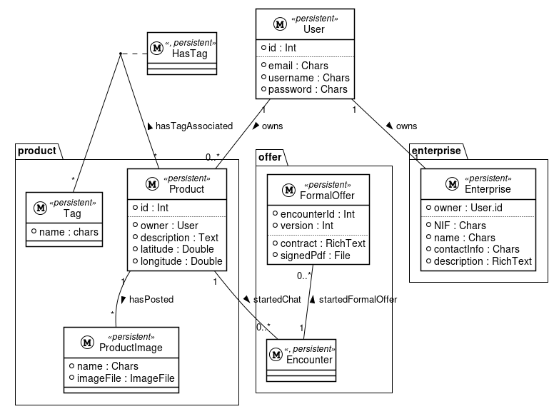

# Table of Contents

1.  [Planification for current Sprint](#org8401f1f)
2.  [Requirements - Product](#orga64f6ec)
3.  [Main use cases](#org5c7a56e)
4.  [General architecture](#org572fd2b)
5.  [Database model](#org0ff3759)
    1.  [Users model](#org151964e)
    2.  [Enterprise Module](#org0b760dc)
    3.  [Product Module](#org092afae)
6.  [Web application](#orgd1a0e62)
    1.  [Authentication](#org19d994a)
7.  [Financial Factors](#orgb24ae55)

# Planification for current Sprint

Tasks

-   Sprint backlog
-   Dedication time to each one (an estimation)
-   Indicator related to evolution between Sprints. Concretely, if there
    is some change it should be specified

# Requirements - Product

Tasks

-   The current list of requirements should be well defined and well explained for any participant.
-   Indicator related to evolution between Sprints. Concretely, if there is some change, for example new requirements or modification inside an existing one, it should be specified.

# Main use cases

Tasks

-   List
-   Reason to be essential
-   Indicator related to evolution between Sprints. Concretely, if there is some change it should be specified.

# General architecture

Tasks

-   Definition (relational diagram, image, etc.)
-   Explanation
-   Decisions taken
-   Indicator related to evolution between Sprints. Concretely, if there is some change it should be specified.

# Database model

The database model can be looked on at the figure [18](#org40b8ca7). In the following sections, it will be discussed in a module to module basis why and how they are done.

## Users model

The users model is already provided by Django framework. Its purpose is to be able to store the usernames and password in a secure way. It was only needed to do the operations needed for the authentication and not the CRUD operations on the User, based on a JWT bearers shcema. In [6.1](#org19d994a) it will be explained fully on detail about how we did the authentication process.

## Enterprise Module

We wanted to have a separated table of the user with the data that we need from the enterprises to work properly. It is a well known practice to separate the user specific fields in another table instead of extending the User model. In this way, we can use 3rd party apps that are well tested for authentication and authorization.

## Product Module

Each enterprise

-   Plantuml diagram
-   The purpose of each model
-   Decisions taken
    -   Why we did tag as we did.
-   The last one is for the other sprints.

Tasks

-   Definition (for example: relational diagram)
-   Explanation
-   Decisions taken
-   Indicator related to evolution between Sprints. Concretely, if there is some change, for example new requirements or modification inside an existing one, it should be specified.

# Web application

## Authentication

Tasks
  Main screens.

-   Relations
-   Decisions taken

# Financial Factors

Tasks

-   Cash flow (ideally, 4 years) by quarters or months. In relation with the Sprint 1, it implies summarize the work done during Sprint 1.
-   Flow chart. It should show when the cash flow will be positive for the first time that is, you will not need borrowed money.
-   To calculate payback and annual ROI with NPV, IRR and BEP.
-   It is needed to offer explanations to the previous points.
-   If you perfume the previous points of financial factors by scenarios (optimistic, normal, and pessimistic), it will be valued as extra work.
-   Indicator related to evolution between Sprints. Concretely, if there are some changes it should be specified.

