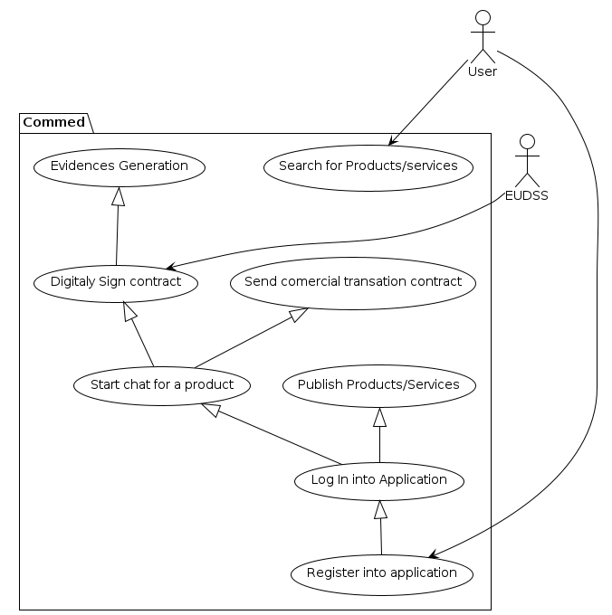
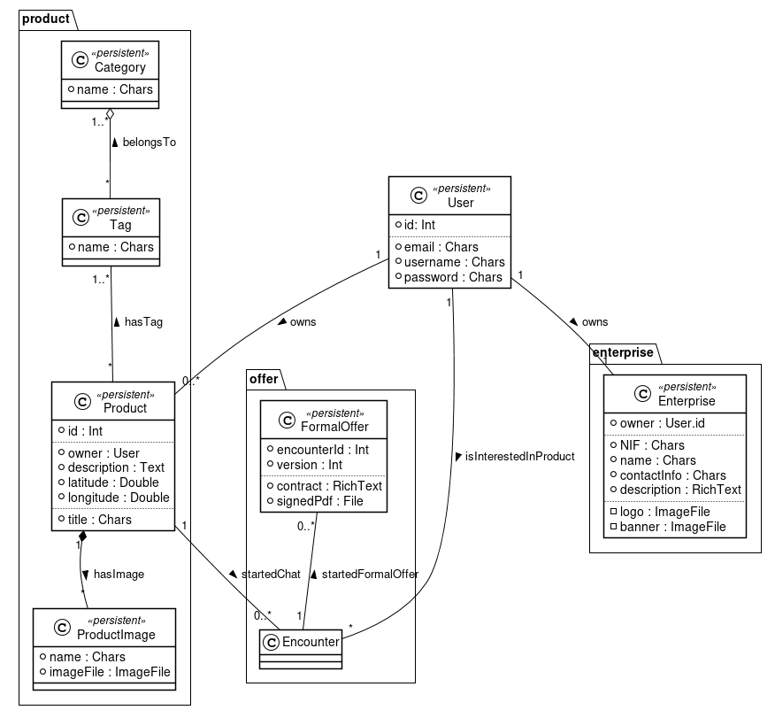

# Table of Contents

1.  [Planification for current Sprint](#org71edfcd) 
2.  [Requirements - Product](#org9935dda) 
3.  [Main use cases](#orge7ab8cc) 
4.  [General architecture](#orgfde3214) 
5.  [Database model](#org9739469) 
    1.  [Users model](#org9a18c0b)
    2.  [Enterprise Module](#orgcfa15d1)
    3.  [Product Module](#org1d0ee40)
    4.  [Formal Offer module](#org29d0d47)
        1.  [We didn&rsquo;t make any notes for the products](#orgcfe654e)
6.  [Web application](#orgda444e6) 
    1.  [Authentication](#org8d3dfe4)
7.  [Financial Factors](#orgf7f9ad1) 

# Planification for current Sprint

The first thing done regarding the planification of the project was to define the behaibour of our aplication in a list of user stories. This list, exposes all the actions that the user can do with our application and explains different ways of interacting with it.

The next step was creating a Scrum Board inside a Github project with the following structure:

After, we did a meeting in order to fullfill the product backlog with all the tasks that had to be done. This tasks were related to User Stories, but we divided it in order to get as a result a product backlog with a lot of glanularity in tasks.

Once we created all the tasks, we started reviewing each one of it  descriving what has to be done and giving a weight based on the complexity of the task. This weight is given following the Fibbonacci Sequence.

After that, we moved all the tasks that we thought that had to be done in the First Sprint to the To do column, which is the column related to the Sprint Backlog. 

Relating to the assignation of the tasks, we thought that each person of the group can be the one that chooses the tasks that he/she wants to complete and self assign it to himself.

Sprint 1 Backlog:
    
    - Configure DB
        - size: 2
    - Configure Swager
        - size: 3
    -Authentication for some API endpoints
        - size: 8
        - US1, US2
    - Conteinarize Aplication:
        - size: 5
    - Create Enterprise Model
        - size: 1
        - US3
    - Create Enterprise CRUD
        - size: 3
        - US3
    - Create Product Model
        - size: 1
        - US6
    - Create Product CRUD
        - size: 3
        - US6
    - Create CI Pipeline for running tests
        - size: 5
    - Financial Case - Cash Flow
        - size: 8
    - Financial Case - Flow Chart
        - size: 8
    - Financial Cas - Payback and Indices
        - size: 3
    - Create Search endpoint
        - size: 8
        - US4
    - Digital Signature Service
        - size: 13
        - US11 US12
    - Create Encounter Model
        - size: 1
        - US10
    - Create Encounter CRUD
        - size: 3
        - US10
    - Create Formal Offer Model
        - size: 1
        - US 10
    - Create Formal Offer CRUD
        - size: 3
        - US: 10
    - Automatic Deploy CD
        - size: 5
    - Admin Statistics
        - size: 8    

# Requirements - Product

In this section we will be detailing the list of requirements that our aplication has to offer to the user: 

**Sprint 1:**

Functional Requirements:

- The application has to let all kind of users search for products or servicies.
- The application has to let users register into the application.
- The application has to let users log in to the aplication if they have an active acount on the system.
- The aplication has to let users to create a enterprise profile if they are loged in.
- The aplication has to let loged in users to publish products or serices.
- The application has to let loged in users interested with a product/service start a chat with the owner of it.
- The application has to let loged in users that are owning products to chat with interested users through a chat.
- The application has to let loged in users to send comercial transaction contracts when an agreement has been reached.
- The aplication has to let loged in users sign comercial transaction contracts send by the owner of a product we're interested in.
- The application has to generate evidences for both sides of the commercial agreement.

Non Functional Requirements:

- The application has to be the most usable possible.
- The application has to be compliant and respect the laws that run in every country where it's abailavle for.
- The application has to be efficient and without large waiting times for the client.
- The application has to be portable and easy to deploy.
- The application has to be escalable and allways leave the code open to the possibility to add new features in the future.

# Main use cases

- **Register into application** 
    - **Actors:** User
    - **Purpose:** Let user register into the aplication system
    - **Description:**  Provide a screen with a form in which the user is going to be able to fullfill it and send the information to our system in order to be registered in our system.
- Log In into Application
    - **Actors:** 
    - **Purpose:** 
    - **Description:**
- Search for Products/services
    - **Actors:** 
    - **Purpose:** 
    - **Description:**
- Publish Products/Services
    - **Actors:** 
    - **Purpose:** 
    - **Description:**
- Start chat for a product
    - **Actors:** 
    - **Purpose:** 
    - **Description:**
- Send comercial transation contract
    - **Actors:** 
    - **Purpose:** 
    - **Description:**
- Evidences Generation
    - **Actors:** 
    - **Purpose:** 
    - **Description:**

# General architecture

Tasks

-   Definition (relational diagram, image, etc.)
-   Explanation
-   Decisions taken
-   Indicator related to evolution between Sprints. Concretely, if there is some change it should be specified.

# Database model
The database model can be looked on at the figure [1](img). In the following sections, it will be discussed in a module to module basis which purpose do they serve and which models do they have to achieve that.

## Users model

The users model is already provided by Django framework. Its purpose is to be able to store the usernames and password in a secure way. It was only needed to do the operations needed for the authentication and not the CRUD operations on the User, based on a JWT bearers shcema. In [6.1](#org712facd) it will be explained fully on detail about how we did the authentication process.

## Enterprise Module

It is a well known practice, inside the Django framework, to separate the user specific fields in another table instead of extending the User model. In this way, 3rd party apps can be used, for example for the authentication part. With this method, not only such information as the name, the contact, or their description can be stored for a specific user, but also 3rd party apps that operate on the user can still be used.

## Product Module

Each enterprise can post a number of products depending on the plans that they have subscribed. This module models the necessary data that should be stored to do the database.

For the searcher endpoint it will be needed a way to categorize the product. For this, it will be used Spacy, which lets us extract keywords and match against more general tags. For example, it can categorize &ldquo;apple&rdquo; as &ldquo;fruit&rdquo;. Then, when a client wants to search for a &ldquo;pear&rdquo;, instead of searching against the whole database, it will only search on the &ldquo;fruit&rdquo; tag.

To achieve this purpose, we store the tags that are currently used in a table, and we have a many to many relationship between the Product and Tag table. We made a table for the Tag instead of an enumaration as the Tag table will be increased programatically when it encounters a new tag that does not relate to anything at all.

In the near future, and, given the fact that the clients won&rsquo;t know about this inside feature, we will rearrenge the tags to minimize the distance and provide a better suport.

## Formal Offer module

In this module we will have the models that serve the purpose to create the formal offer. The most important model is the FormalOffer, which contains the necessary information to create the unsigned PDF, as well as the current PDF. It iterates with different versions between the enterprise that offers the service and the one that has solicited them, sending them through the chat. At the end, the signed PDF will be agreed upon and signed by both enterprises.

Upon generating the requirements of the FormalOffer, it was said that it could be provided the different contracts that have been made with the same product, as in most cases, they will be similar.

The problem was that when the clients start their chat they have some time to discuss how and what should be done in the formal offer in a period of time. For this reason, it was decided that creating a model that has a chat related to them and the product would be better than storing it in a FormalOffer that all the other values are Null. With this solution in mind, the Encounter model was created.

# Web application

## Authentication
The problem was solved by using two well known apps in the Django community. The first is mantained by an Enterprise called *IntenCT* who specilizes on doing web applications using Django. This enterprise published a library that provides an authentication system. It specializes on keeping users that come from different apps, while proving a solution for this based on tokens. With this, implementing simple JavaScript Web Tokens are just a step on the configuration, but also adding a way to integrate other services for authentication, as a **Log In with Google** button use case.

The other app that is used provides a REST entrypoint for the first one. In this way, with just a small configuration a ready-to-go service is achieved. 

Tasks
  Main screens.

-   Relations
-   Decisions taken

# Financial Factors

Tasks

-   Cash flow (ideally, 4 years) by quarters or months. In relation with the Sprint 1, it implies summarize the work done during Sprint 1.
-   Flow chart. It should show when the cash flow will be positive for the first time that is, you will not need borrowed money.
-   To calculate payback and annual ROI with NPV, IRR and BEP.
-   It is needed to offer explanations to the previous points.
-   If you perfume the previous points of financial factors by scenarios (optimistic, normal, and pessimistic), it will be valued as extra work.
-   Indicator related to evolution between Sprints. Concretely, if there are some changes it should be specified.

